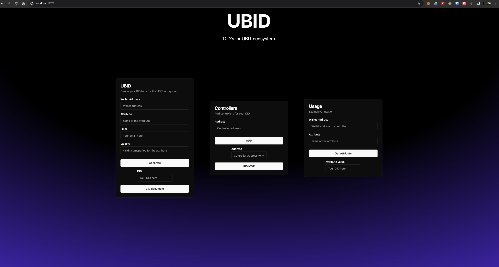
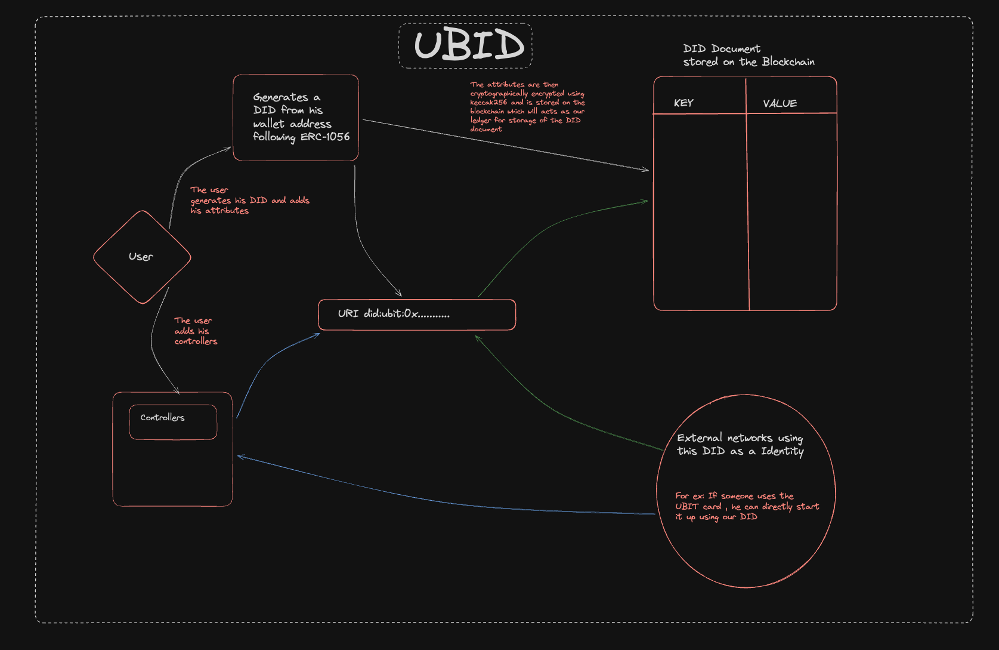

<!-- Improved compatibility of back to top link: See: https://github.com/othneildrew/Best-README-Template/pull/73 -->
<a name="readme-top"></a>
<!--
*** Thanks for checking out the Best-README-Template. If you have a suggestion
*** that would make this better, please fork the repo and create a pull request
*** or simply open an issue with the tag "enhancement".
*** Don't forget to give the project a star!
*** Thanks again! Now go create something AMAZING! :D
-->


<!-- PROJECT SHIELDS -->
<!--
*** I'm using markdown "reference style" links for readability.
*** Reference links are enclosed in brackets [ ] instead of parentheses ( ).
*** See the bottom of this document for the declaration of the reference variables
*** for contributors-url, forks-url, etc. This is an optional, concise syntax you may use.
*** https://www.markdownguide.org/basic-syntax/#reference-style-links
-->
[![Contributors][contributors-shield]][contributors-url]
[![Forks][forks-shield]][forks-url]
[![Stargazers][stars-shield]][stars-url]
[![Issues][issues-shield]][issues-url]
[![MIT License][license-shield]][license-url]


<!-- PROJECT LOGO -->
<br />
<div align="center">
 
  <a href="https://github.com/Sahilgill24/UBID">
    
  </a>

<h1 align="center">UBID</h1>

  <p align="center">
     <b>UBID</b> facilitates distributed key generation using <b>FROST</b>, a threshold Schnorr signature scheme. Participants contribute to a multi-party computation protocol, generating key shares without learning the complete secret. Made on top of the <b><a href="https://fluence.dev/">Fluence Netowork</a></b> providing decentralized serverless compute/
    <br />
    <a href="https://github.com/Sahilgill24/UBID"><strong>Explore the docs »</strong></a>
    <br />
    <br />
    <a href="https://github.com/Sahilgill24/UBID">View Demo</a>
    ·
    <a href="https://github.com/Sahilgill24/UBID/issues/new?labels=bug&template=bug-report---.md">Report Bug</a>
    ·
    <a href="https://github.com/Sahilgill24/UBID/issues/new?labels=enhancement&template=feature-request---.md">Request Feature</a>
  </p>
</div>


<!-- TABLE OF CONTENTS -->
<details open>
  <summary>Table of Contents</summary>
  <ol>
    <li>
      <a href="#about-the-project">About The Project</a>
    </li>
    <li>
      <a href="#understanding-UBID">Understanding UBID</a>
      <ul>
        <li><a href="#architecture">Architecture</a></li>
      </ul>
    </li>
    <li>
      <a href="#getting-started">Getting Started</a>
      <ul>
        <li><a href="#prerequisites">Prerequisites</a></li>
        <li><a href="#installation">Installation</a></li>
      </ul>
    </li>
    <li><a href="#usage">Usage</a></li>
    <li><a href="#roadmap">Roadmap</a></li>
    <li><a href="#contributing">Contributing</a></li>
    <li><a href="#license">License</a></li>
    <li><a href="#contact">Contact</a></li>
    <li><a href="#acknowledgments">Acknowledgments</a></li>
  </ol>
</details>


<!-- ABOUT THE PROJECT -->
## About The Project

</img>


UBID is a decentralized identity (DID) solution designed specifically for the UBIT ecosystem, providing robust and secure identity management capabilities. Built on blockchain technology, UBID offers unique identifiers that are cryptographically verifiable and self-owned, empowering users with control over their digital identities without relying on centralized authorities. It enables seamless integration across UBIT's ecosystem, allowing users to manage attributes, authenticate transactions, and interact securely with decentralized applications (DApps). UBID enhances privacy, security, and interoperability within UBIT, ensuring trustworthy and efficient digital identity management for all participants


<p align="right">(<a href="#readme-top">back to top</a>)</p>

## Understanding UBID

A DID is an Identifier that allows you to lookup a DID document that can be used to authenticate you and messages created by you.
Any Ethereum account regardless of whether it's a key pair or smart contract based is considered to be an account identifier.
An identity needs no registration.

Each identity has multiple address which maintains ultimate control over it, which are called the controllers of the DID. By default, each identity is controlled by itself. As ongoing technological and security improvements occur.
Now coming to the DID document 
A DID (Decentralized Identifier) document is a JSON-LD (JSON Linked Data) format document that encapsulates essential information about a decentralized identifier. It serves as a structured representation of an entity's digital identity within decentralized identity systems
```
{
    "@context": "https://www.w3.org/ns/did/v1",
    "id": "did:ubit:0x8f26d683822e60d522b58f7db63d352cb7fae6e4",
    "controller": [
        "did:ubit:0x8f26d683822e60d522b58f7db63d352cb7fae6e4"
    ],
    "verificationMethod": [
        {
            "id": "did:ubit:0x8f26d683822e60d522b58f7db63d352cb7fae6e4#vm-0",
            "type": "Secp256k1VerificationKey2018",
            "controller": "did:ubit:0x8f26d683822e60d522b58f7db63d352cb7fae6e4",
            "publicKeyHex": "0x8f26d683822e60d522b58f7db63d352cb7fae6e4"
        }
    ],
    "authentication": [
        "did:ubit:0x8f26d683822e60d522b58f7db63d352cb7fae6e4#vm-0"
    ],
    "capabilityInvocation": [
        "did:ubit:0x8f26d683822e60d522b58f7db63d352cb7fae6e4#vm-0"
    ],
    "capabilityDelegation": [
        "did:ubit:0x8f26d683822e60d522b58f7db63d352cb7fae6e4#vm-0"
    ],
    "assertionMethod": [
        "did:ubit:0x8f26d683822e60d522b58f7db63d352cb7fae6e4#vm-0"
    ],
    "keyAgreement": [
        "did:ubit:0x8f26d683822e60d522b58f7db63d352cb7fae6e4#vm-0"
    ],
    "service": [
        {
            "id": "did:ubit:0x8f26d683822e60d522b58f7db63d352cb7fae6e4#mailbox",
            "type": "DIDComm",
            "serviceEndpoint": "http://localhost:5173/network"
        }
    ],
    "attributes": {
        "0x120d9a3c10568303ea1744ea1c17ec39fbca86bc": {
            "value": "",
            "validity": 0
        }
    }
}
```
Now as you understand the basics of what a DID is moving on to the implementation of UBID and how it works, also a point to note it follows the ERC-105 standard and also is compliant with the W3C standards 
    
    
</img>


# Implementation of UBID


### Data Structures

- **DIDDocument Struct**: Each DID is represented by a `DIDDocument` structure containing:
  - `controllers`: An array of Ethereum addresses authorized to manage the DID.
  - `attributes`: A mapping of attribute names (hashed) to `Attribute` structures.
  - `lastUpdated`: Timestamp of the last update to the DID document.

- **Attribute Struct**: Defines an attribute within a DID document:
  - `value`: Arbitrary byte data representing the attribute value.
  - `validity`: Timestamp indicating until when the attribute is valid.

### Events

- **DIDAttributeChanged**: Fired when an attribute within a DID document is added, updated, or revoked. Provides information about the identity, attribute name, value, validity period, and timestamp of the change.
  
- **DIDControllerChanged**: Triggered when controllers are added or removed from a DID document. Provides details about the identity, controller address, and timestamp of the change.

### Modifiers

- **onlyController**: A modifier that restricts access to specific functions based on whether the caller is an authorized controller of the DID.

### Functions

- **`generateDID(address walletAddress)`:** Utility function to generate a DID string (`did:ubit:{walletAddress}`) based on an Ethereum wallet address.

- **Controller Management:**
  - **`addController(address identity, address controller)`:** Adds a new controller to manage the DID document of a specified identity. Requires authorization from an existing controller.
  
  - **`removeController(address identity, address controller)`:** Removes a controller from managing the DID document. Ensures that at least one controller remains for each DID.

- **Attribute Management:**
  - **`setAttribute(address identity, bytes name, bytes value, uint256 validity)`:** Sets an attribute with a specified name, value, and validity period for a DID. Requires authorization from an authorized controller.
  
  - **`revokeAttribute(address identity, bytes name)`:** Revokes (removes) an attribute from a DID document. Requires authorization from an authorized controller.

- **Query Functions:**
  - **`getDIDDocument(address identity)`:** Retrieves the complete DID document in JSON format. Includes information about the DID (`did:ubit:{walletAddress}`), controllers, verification methods, authentication capabilities, assertion methods, key agreement, and associated service endpoints.
  
  - **`getAttribute(address identity, bytes name)`:** Retrieves the value of a specific attribute from the DID document.

### Utilities

- **String Conversion Functions:**
  - **`toHexString(address account)`, `toHexString(bytes memory data)`:** Helper functions to convert Ethereum addresses and byte data to hexadecimal strings for DID document formatting.
  
  - **`uint2str(uint256 _i)`:** Converts a uint256 number to a string representation.

- **`toAsciiString(address x)`, `char(bytes1 b)`:** Functions to convert an Ethereum address into an ASCII string representation for DID purposes.

## Usage

### Deployment

Deploy the contract on an Ethereum-compatible blockchain using development tools such as Remix, Truffle, or Hardhat. Ensure that the SafeMath library or equivalent is accessible for safe arithmetic operations.

### Interacting with the Contract

Use Ethereum wallets or applications to interact with the deployed contract:

1. **Adding Controllers**: Assign controllers (`addController`) to manage the DID document of specific identities. Controllers can manage attributes and make changes to the DID.
  
2. **Setting Attributes**: Set attributes (`setAttribute`) to define properties or capabilities associated with a DID. Attributes are stored with a validity period, enhancing security and ensuring data currency.
  
3. **Querying Information**: Retrieve DID documents (`getDIDDocument`) to view all registered controllers, attributes, and associated service endpoints. This enables verifiable identity information retrieval in a decentralized manner.
  
4. **Revoking Attributes**: Remove attributes (`revokeAttribute`) when they are no longer needed or valid, maintaining the integrity and relevance of DID attributes over time.


### Requirements

- **Solidity Version**: ^0.8.19 (or compatible with required libraries)
  
- **Development Environment**: Ethereum development tools (Remix, Truffle, Hardhat) for contract deployment, testing, and interaction.


## Future


### Project Vision

- UBID is currently based on a ledger-based blockchain for decentralized identity management.
- The project aims to expand to integrate with web-based technologies and other decentralized ecosystems.

### Current Contract and Limitations

- Utilizes the `DIDRegistryBase.sol` contract for basic DID management.
- Lacks key rotation mechanisms due to concerns over gas consumption during implementation.

## Future Roadmap

### Key Rotations Implementation

- Implement key rotation mechanisms within `DIDRegistryBase.sol` to enhance DID security.

### Gas Optimization

- Optimize gas consumption for key rotations and other contract functionalities.

### Expansion to Web and Beyond

- Extend UBID's functionality beyond blockchain ledger systems.
- Integrate with web-based platforms and diverse decentralized ecosystems.

## Get Involved

- Contributions and feedback are welcome from developers, researchers, and enthusiasts.
- Join the community to contribute to UBID's evolution in decentralized identity management.

## License

This project is licensed under the MIT License. See the [LICENSE](./LICENSE) file for details.


   


<p align="right">(<a href="#readme-top">back to top</a>)</p>


<!-- ROADMAP -->


See the [open issues](https://github.com/Sahilgill24/UBID/issues) for a full list of proposed features (and known issues).

<p align="right">(<a href="#readme-top">back to top</a>)</p>

## Research

These are the resources I used for the hackathon for understanding and implementation of DID's
https://www.w3.org/TR/did-core/
<br/>
https://www.youtube.com/watch?v=t8lMCmjPKq4


<!-- CONTRIBUTING -->
## Contributing

Contributions are what make the open source community such an amazing place to learn, inspire, and create. Any contributions you make are **greatly appreciated**.

If you have a suggestion that would make this better, please fork the repo and create a pull request. You can also simply open an issue with the tag "enhancement".
Don't forget to give the project a star! Thanks again!

1. Fork the Project
2. Create your Feature Branch (`git checkout -b feature/AmazingFeature`)
3. Commit your Changes (`git commit -m 'Add some AmazingFeature'`)
4. Push to the Branch (`git push origin feature/AmazingFeature`)
5. Open a Pull Request

<p align="right">(<a href="#readme-top">back to top</a>)</p>


<!-- LICENSE -->
## License

Distributed under the MIT License. See `LICENSE.txt` for more information.

<p align="right">(<a href="#readme-top">back to top</a>)</p>


<!-- CONTACT -->
## Contact


Project Link: [https://github.com/Sahilgill24/UBID](https://github.com/Sahilgill24/UBID)

<p align="right">(<a href="#readme-top">back to top</a>)</p>


<!-- ACKNOWLEDGMENTS -->

<p align="right">(<a href="#readme-top">back to top</a>)</p>


<!-- MARKDOWN LINKS & IMAGES -->
<!-- https://www.markdownguide.org/basic-syntax/#reference-style-links -->
[contributors-shield]: https://img.shields.io/github/contributors/Sahilgill24/UBID.svg?style=for-the-badge
[contributors-url]: https://github.com/Sahilgill24/UBID/graphs/contributors
[forks-shield]: https://img.shields.io/github/forks/Sahilgill24/UBID.svg?style=for-the-badge
[forks-url]: https://github.com/Sahilgill24/UBID/network/members
[stars-shield]: https://img.shields.io/github/stars/Sahilgill24/UBID.svg?style=for-the-badge
[stars-url]: https://github.com/Sahilgill24/UBID/stargazers
[issues-shield]: https://img.shields.io/github/issues/Sahilgill24/UBID.svg?style=for-the-badge
[issues-url]: https://github.com/Sahilgill24/UBID/issues
[license-shield]: https://img.shields.io/github/license/Sahilgill24/UBID.svg?style=for-the-badge
[license-url]: https://github.com/Sahilgill24/UBID/blob/master/LICENSE.txt
[linkedin-shield]: https://img.shields.io/badge/-LinkedIn-black.svg?style=for-the-badge&logo=linkedin&colorB=555
[linkedin-url]: https://linkedin.com/in/linkedin_username
[product-screenshot]: images/image.png
[frost-screenshot]: images/frost.png
[architecture]: images/architecture.png
[Next.js]: https://img.shields.io/badge/next.js-000000?style=for-the-badge&logo=nextdotjs&logoColor=white
[Next-url]: https://nextjs.org/
[React.js]: https://img.shields.io/badge/React-20232A?style=for-the-badge&logo=react&logoColor=61DAFB
[React-url]: https://reactjs.org/
[Vue.js]: https://img.shields.io/badge/Vue.js-35495E?style=for-the-badge&logo=vuedotjs&logoColor=4FC08D
[Vue-url]: https://vuejs.org/
[Angular.io]: https://img.shields.io/badge/Angular-DD0031?style=for-the-badge&logo=angular&logoColor=white
[Angular-url]: https://angular.io/
[Svelte.dev]: https://img.shields.io/badge/Svelte-4A4A55?style=for-the-badge&logo=svelte&logoColor=FF3E00
[Svelte-url]: https://svelte.dev/
[Laravel.com]: https://img.shields.io/badge/Laravel-FF2D20?style=for-the-badge&logo=laravel&logoColor=white
[Laravel-url]: https://laravel.com
[Bootstrap.com]: https://img.shields.io/badge/Bootstrap-563D7C?style=for-the-badge&logo=bootstrap&logoColor=white
[Bootstrap-url]: https://getbootstrap.com
[JQuery.com]: https://img.shields.io/badge/jQuery-0769AD?style=for-the-badge&logo=jquery&logoColor=white
[JQuery-url]: https://jquery.com 